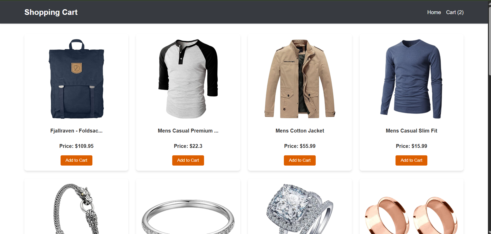
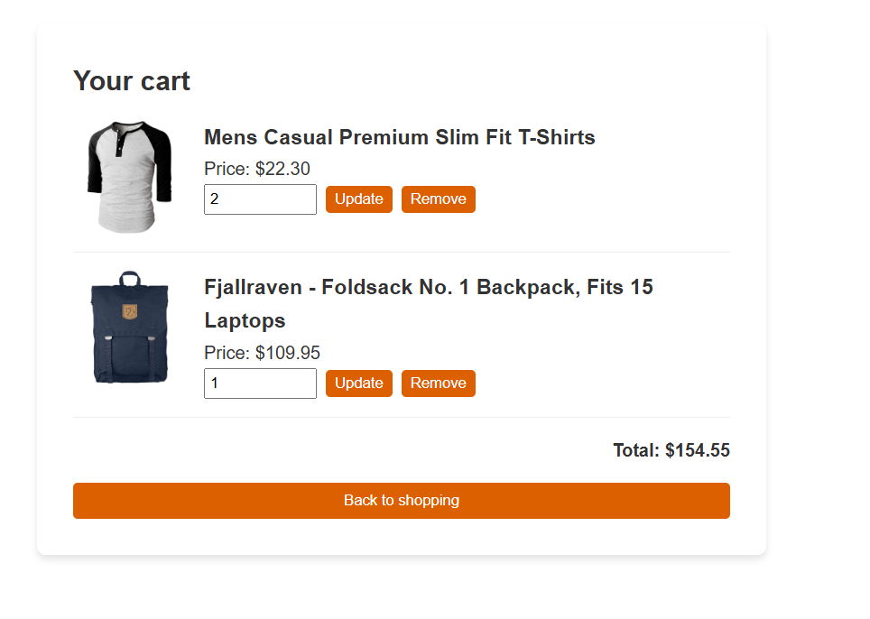

# 🛒 E-Commerce Shopping  

> A responsive React + Redux shopping cart application that allows users to browse products, add items to cart, and manage quantities with real-time total price updates.

---

## 🪞 Overview  

This E-Commerce Shopping app solves the problem of managing cart state efficiently in a frontend application. It allows users to browse products fetched from a live API, add them to a cart, update quantities dynamically, and view real-time total pricing. 

What makes it unique is the use of **temporary cart updates (`tempItems`)** before applying changes — simulating a real-world cart editing experience similar to production e-commerce platforms.

---

## 🚀 Features  

✨ Key things this app can do:  

- 🛍️ Fetch products dynamically from an external API  
- 🛒 Add and remove products from cart  
- 🔄 Update cart quantities with temporary state management  
- 💰 Auto-calculate total price in real time  
- 🔗 Client-side routing using React Router  
- 📦 Global state management using Redux Toolkit  
- ⚡ Async API handling using `createAsyncThunk`  

---

## 🧱 Tech Stack  

| Technology | Purpose |
|------------|----------|
| **React.js** | UI building using component-based architecture |
| **Redux Toolkit** | Global state management |
| **React Redux** | Connecting Redux with React |
| **React Router DOM** | Client-side routing |
| **Axios** | API requests |
| **Fake Store API** | Product data source |
| **CSS3** | Styling and layout |

---

## 📚 What We Have Studied  
  

> Concepts practiced include:  

- Redux Toolkit (`createSlice`, `configureStore`)  
- Async state handling using `createAsyncThunk`  
- Extra reducers for API lifecycle states (pending, fulfilled, rejected)  
- React hooks (`useEffect`, `useDispatch`, `useSelector`)  
- Derived state calculation using `Array.reduce()`  
- Controlled inputs in React  
- Conditional rendering  
- Client-side routing with React Router  
- State synchronization between `items` and `tempItems`  

---

## 🌿 Lessons Learned  

- How to structure scalable Redux slices  
- Handling asynchronous API calls in Redux  
- Managing derived state efficiently  
- Preventing unnecessary re-fetching using status flags  
- Building predictable state flow in a real-world cart system  
- Separating temporary UI state from committed global state  

---

## 🖼️ Screenshots / Demo  

  
  

🔗 **Live Demo:** https://your-demo-link.vercel.app  

---

## 💫 Author  
👩‍💻 **Created by [Aliya](https://github.com/aliyasyeddd)**  
> _“Build. Break. Learn. Repeat.”_ 🌸  

---
